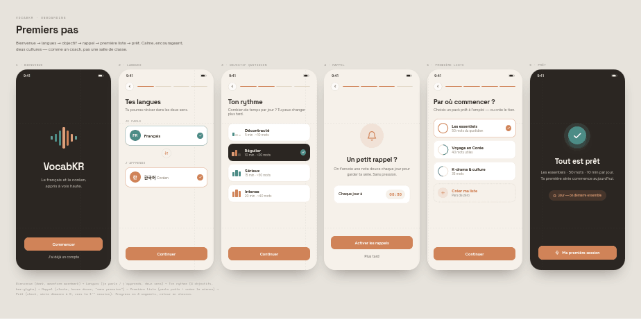
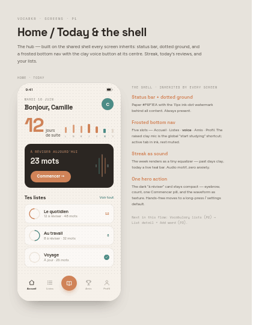
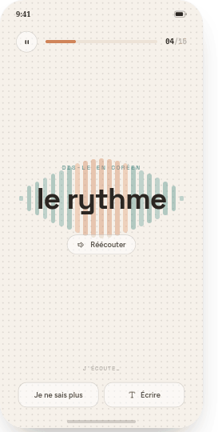
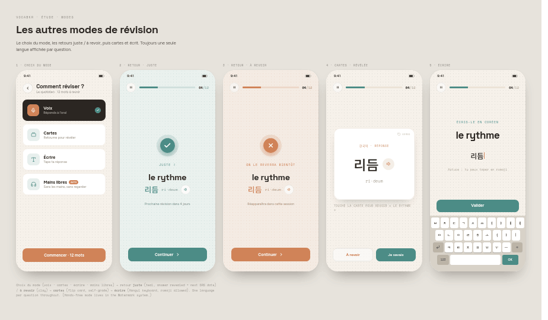
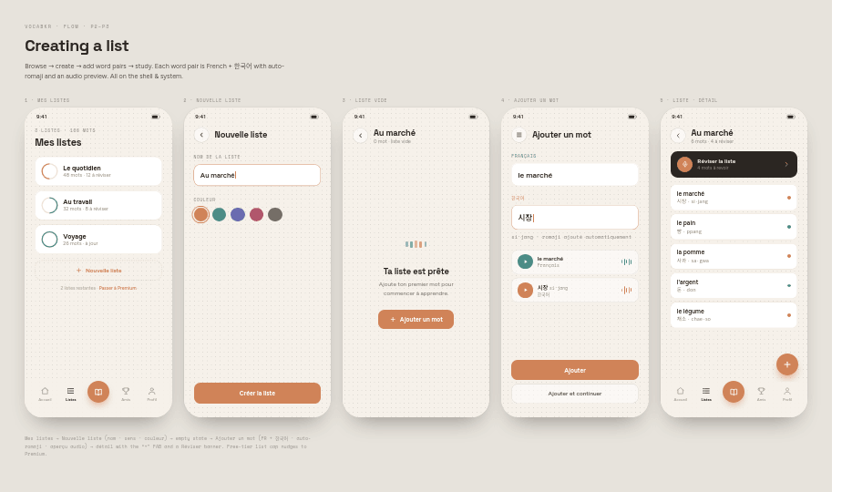
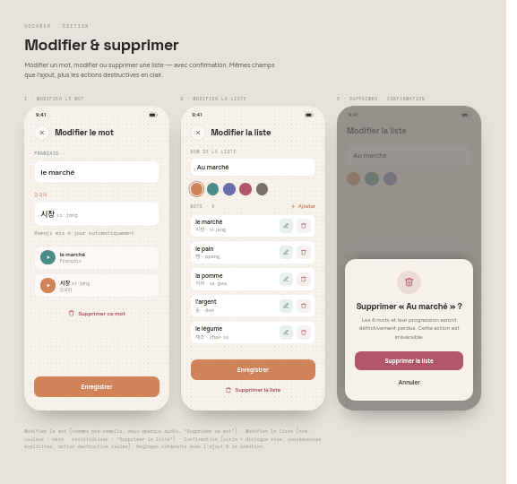
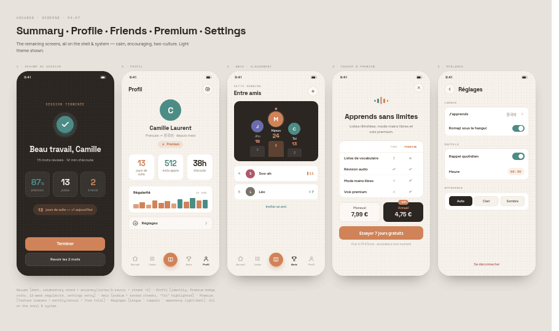
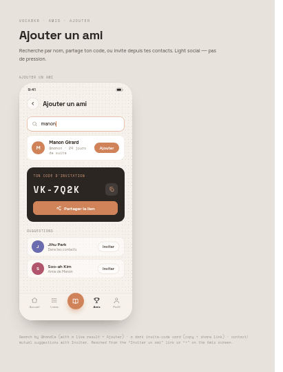

# Design reference — screens & design system

Visual reference for VocabKR (the FR ↔ KO vocabulary app). These are design
**prototypes / mockups**, not production code — the task is to recreate them in
the Flutter codebase.

The screenshots below were originally embedded in the Notion page
**"VocabKR — Design System & Screen Reference"** via temporary
`claudeusercontent.com` URLs that expire. They're mirrored here so the design
reference is permanent and version-controlled in the repo.

> Canonical design-system spec (tokens, components, motion, full screen notes)
> currently lives in Notion: **VocabKR — Design System & Screen Reference**
> (under the "VocabApp — Flutter App" hub).

All frames are designed at a **380 px-wide** phone frame; scale proportionally.

## Screens

| Screen | Preview |
|--------|---------|
| **Onboarding** — first run, 6 steps (Bienvenue · Langues · Ton rythme · Rappel · Première liste · Prêt) |  |
| **Home / Today** — greeting, streak equalizer, "À réviser" card, list cards |  |
| **Study · Voice** — canonical **F1 (Space Grotesk)** frame; ignore the other font-exploration frames |  |
| **Quiz Modes** — mode picker + feedback (juste / à revoir) + Cartes + Écrire |  |
| **Lists Flow** — Mes listes · Nouvelle liste · empty state · Ajouter un mot · Liste détail |  |
| **Edit Flow** — Modifier le mot · Modifier la liste · delete confirmation |  |
| **Screens 2** — Résumé · Profil · Amis (classement) · Premium · Réglages |  |
| **Add Friend** — search, invite-code card, suggestions |  |

## Notes for implementation

- **Theming:** both light + dark are required. A full dark theme of every screen
  is **not yet designed** — confirm with design before shipping dark variants.
  Relevant to the open task *"Quiz screen — light/dark card redesign"*.
- **Study · Voice:** only the **F1 / Space Grotesk** frame is canonical.
- No raster image assets in the app itself — the dotted ground and waveforms are
  drawn in code.
