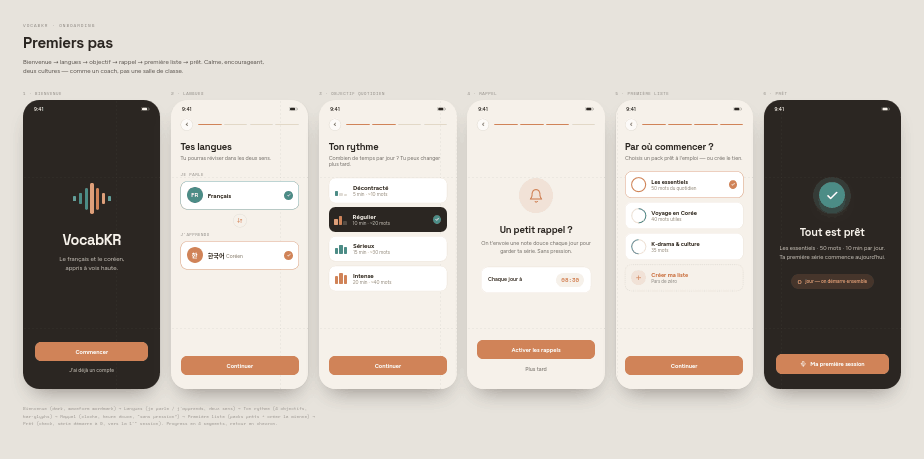
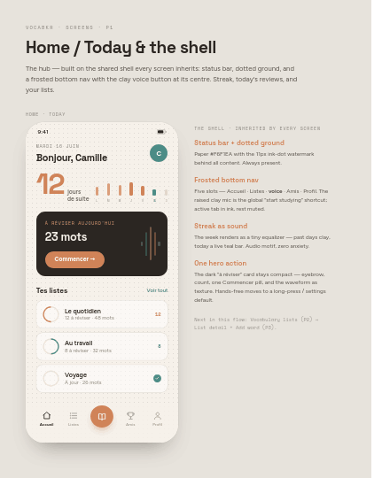
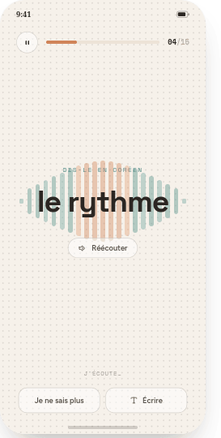
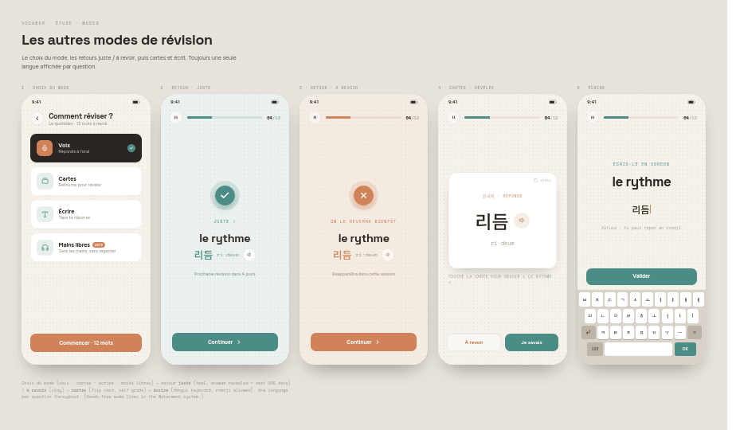
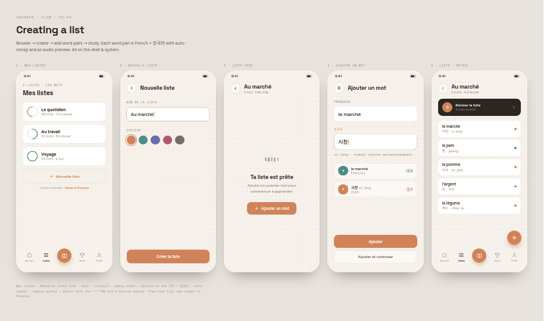
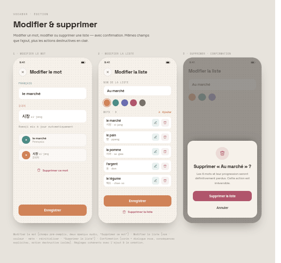
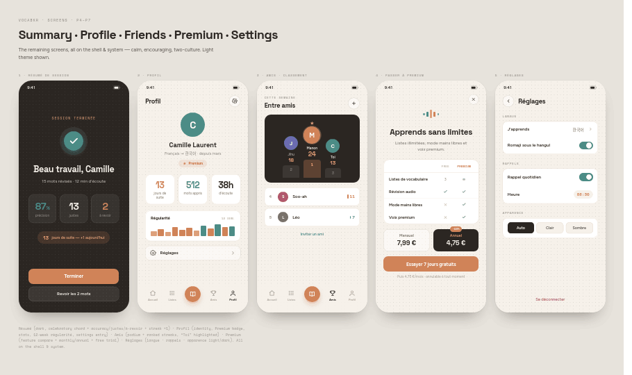
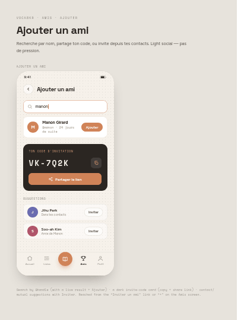

# Design references

> **Current implementation reference:**
> [V3 — Sentier de cartes](v3-sentier-de-cartes.md).
>
> This file catalogs the legacy v1/v2 materials. It does **not** describe the
> current V3 slice and must not be used alone to implement a new V3 screen.

These are historical visual references for VocabKR. They are prototypes and
mockups, not production code.

The screenshots below were originally embedded in the Notion page
**"VocabKR — Design System & Screen Reference"** via temporary
`claudeusercontent.com` URLs that expire. They're mirrored here so the design
reference is permanent and version-controlled in the repo.

> The original V3 archive and its tokens informed the versioned V3 note and
> Flutter tokens. New product decisions belong in the repository first; Notion
> must not be the sole source of truth.

> The repository decision record for interaction language lives in
> [`map/interaction-language.md`](map/interaction-language.md): navigation
> dives into a selected element, flashcard stacks belong only to revision
> quizzes, lesson details use contextual popups, and scrolling is minimized
> but clearly signalled when needed.

All frames are designed at a **380 px-wide** phone frame; scale proportionally.

## Legacy v1/v2 screens

| Screen | Preview |
|--------|---------|
| **Onboarding** — first run, 6 steps (Bienvenue · Langues · Ton rythme · Rappel · Première liste · Prêt) |  |
| **Home / Today** — greeting, streak equalizer, "À réviser" card, list cards |  |
| **Study · Voice** — canonical **F1 (Space Grotesk)** frame; ignore the other font-exploration frames |  |
| **Quiz Modes** — mode picker + feedback (juste / à revoir) + Cartes + Écrire |  |
| **Lists Flow** — Mes listes · Nouvelle liste · empty state · Ajouter un mot · Liste détail |  |
| **Edit Flow** — Modifier le mot · Modifier la liste · delete confirmation |  |
| **Screens 2** — Résumé · Profil · Amis (classement) · Premium · Réglages |  |
| **Add Friend** — search, invite-code card, suggestions |  |

## Legacy notes for implementation

- **Theming:** both light + dark remain product requirements. V3 has partial
  two-theme implementation; its outstanding theme work is listed in
  [v3-sentier-de-cartes.md](v3-sentier-de-cartes.md).
- **Study · Voice:** only the **F1 / Space Grotesk** frame is canonical.
- No raster image assets in the app itself — the dotted ground and waveforms are
  drawn in code.
