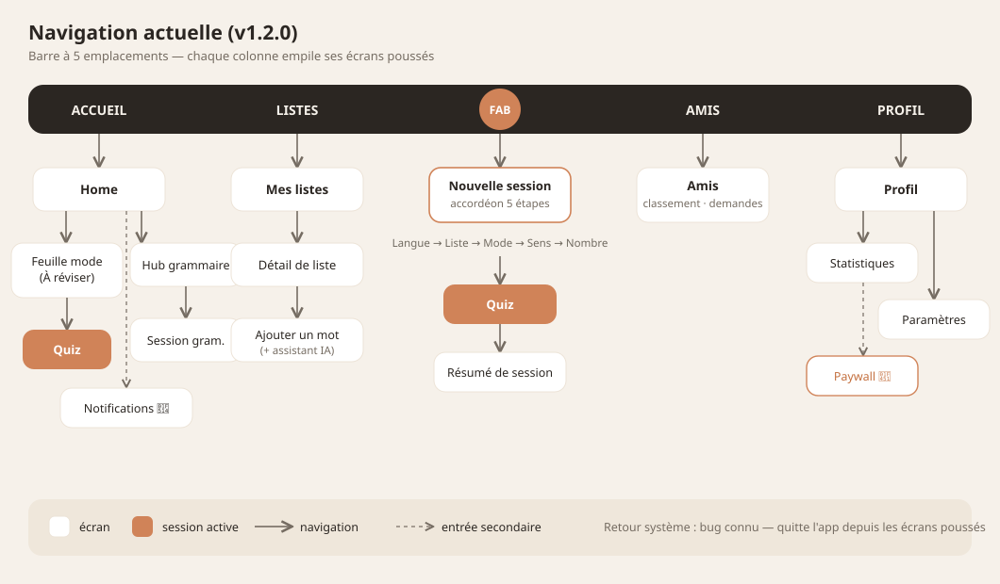
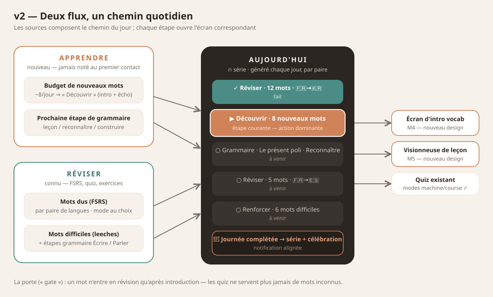
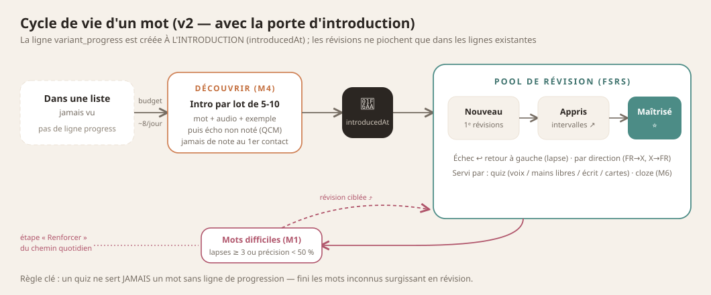
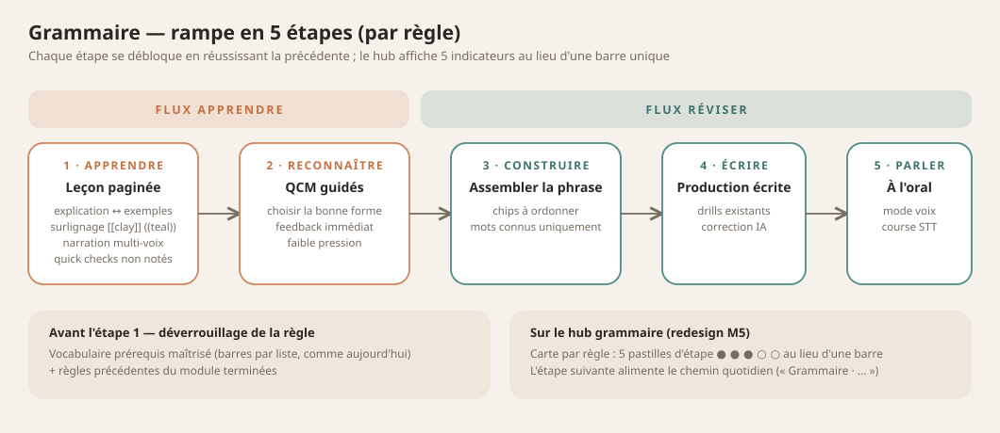

# VocabKR — current app design overview (v1.2.0)

Reference document for designing the v2 screens (daily path, lesson viewer,
vocab intro, dashboard — see `../implementation-plan-v2.md` for which
milestones need design). Screenshots captured live from the release app on a
Galaxy S22 Ultra (1440×3088), 2026-07-25, French UI, light theme.

## Design system

**Personality:** warm paper & ink. Cream background with a subtle dotted
grid, white rounded cards, dark "hero" cards for emphasis, clay (terracotta)
as the action color, teal as the secondary accent. Rounded-everything
(cards 18px, pills 999px). Calm, anti-pressure tone in copy.

### Palette (`lib/core/theme/app_colors.dart`)

| Token | Hex | Use |
|---|---|---|
| paper | #F6F1EA | app background, every screen |
| surface | #EFE7DB | soft secondary surfaces |
| card | #FFFFFF | list cards, inputs, dialogs |
| ink | #2B2622 | primary text + dark hero cards |
| inkDark | #241F1B | hands-free/immersive dark background |
| muted / muted2 / faint | #756C62 / #6F695F / #8A8073 | secondary text → captions |
| line | #ECE3D7 | borders, dividers, progress tracks |
| **clay** | **#D08358** | primary accent: CTAs, FAB, highlights |
| clayDeep / clayButton | #C4703F / #A85A30 | AA-contrast clay text / filled CTA |
| teal / tealButton | #4C8C86 / #3E726D | secondary accent, success tint |
| rose | #B0556B | errors/wrong |
| onDark / onDarkMuted / onDarkFaint | #F6F1EA / #CFC6BA / #9A9086 | text on dark cards |

Dark theme exists (inkDark backgrounds, onDark text) — not captured here.

### Typography (`app_text_styles.dart`, Google Fonts)

- **Space Grotesk** — display/headers (`grotesk()`): greetings, big numbers.
- **Figtree** — body/UI (`fig()`): labels, buttons, card titles.
- **Space Mono** — data & eyebrows (`mono()`): UPPERCASE tracked section
  labels ("TES LISTES", "À RÉVISER"), counters ("01 / 10").
- **Noto Sans KR** — all Hangul (`kr()`), picked per-run via the
  `Languages.usesHangul` resolver.

### Recurring components

- **DottedGround** — the dotted-grid paper background on every screen.
- **FrostedBox** — white rounded-18 card, subtle border.
- **Dark hero card** — ink background, rounded-24: streak + À réviser.
- **Clay pill CTA** — filled rounded-999 button ("Commencer", FAB).
- **Eyebrow section label** — Space Mono UPPERCASE, muted.
- **Accordion setup** — collapsible sections with chosen-value summaries
  (quiz setup).
- **Bottom nav** — 5 slots: Accueil, Listes, **center clay FAB (new
  session)**, Amis, Profil.
- **Waveform motif** — teal/clay bars (streak card, brand accent).

## Screen catalog

| # | Screenshot | Screen | Notes / v2 impact |
|---|---|---|---|
| 00 | `screenshots/00-preload-gate.png` | Preload gate | Spinner + "Synchronisation…" on cold open. **v2: replaced by daily-path skeleton?** |
| 01 | `screenshots/01-home.png` | Home | Greeting, dark streak card (waveform), dark À réviser card + clay CTA, grammar entry, lists preview. **v2: becomes the daily path — biggest redesign.** |
| 02 | `screenshots/02-review-mode-sheet.png` | Review-mode sheet | Bottom sheet: Voix / Mains libres / Écrit / Cartes. Pattern to keep for per-step mode choice. |
| 03 | `screenshots/03-grammar-hub.png` | Grammar hub | Per-rule cards: lock state, unlock progress bar + per-prerequisite-list bars. **v2: gains per-stage progress (5 stages).** |
| 04 | `screenshots/04-notifications.png` | Notifications settings | Reminder scheduling. |
| 05 | `screenshots/05-lists.png` | Mes listes | White cards + colored dot per list, clay FAB "Nouvelle liste". |
| 06 | `screenshots/06-list-detail.png` | List detail | FR/KR word rows, export/menu, "Ajouter un mot" CTA. |
| 07 | `screenshots/07-add-word-dialog.png` | Add-word dialog | Two fields with flags (list's pair), AI translate assist chips. |
| 08 | `screenshots/08-social.png` | Amis | Friends / leaderboard tabs. **v2: challenges revival lives here (M9).** |
| 09 | `screenshots/09-profile.png` | Profil | Avatar, streak/mastered stats, subscription card, Statistiques + Paramètres entries. |
| 10 | `screenshots/10-stats.png` | Statistiques | Mastered-words chart + recent sessions. **v2: full dashboard redesign (M7 — multi-scale + CEFR).** |
| 11 | `screenshots/11-settings.png` + `11b` | Paramètres | Account, theme pills, audio rows (segmented), speech engine toggle, language, subscription. |
| 12 | `screenshots/12-paywall.png` | Paywall | Premium pitch (ElevenLabs voices, unlimited AI). |
| 13 | `screenshots/13-quiz-setup.png` + `13b/c/d` | Nouvelle session (accordion) | Language-first: Langue → Liste (En cours d'étude / Pas encore étudiées + peek eye) → Mode → Sens → Cartes/session. |
| 14 | `screenshots/14-quiz-flashcard.png` + `14b/c` | Quiz (Cartes) | Progress bar + counter, big word on paper, tap-to-reveal, self-grade ("À revoir" / "Je savais"). Voice modes share this canvas with waveform/mic states (not captured — needs mic). |

Not captured: hands-free/voice quiz states (mic-dependent), quiz summary,
welcome/auth/onboarding (would need sign-out), dark theme variants, VocabKR
Dev-only DEV settings section.

### Flow — current navigation

How the 21 screens above connect (bottom-nav columns + pushed routes):

## Part 2 — screens to design for v2

> **Superseded for handoff:** the full v2 rethink (new navigation model,
> end-to-end flows, per-screen briefs) now lives in
> **`v2-ux-architecture.md`** — give Claude Design THAT document, with
> this one as the current-state visual reference. The tables below are
> kept as a quick index.

The briefs below summarize each screen to ADD or REDESIGN; full functional
specs live in the linked plan docs. Everything must use the design system
above (paper/ink/clay/teal, the four type families, FrostedBox/dark-hero
patterns) and spec its empty/loading/error states.

### Flow — the v2 architecture at a glance

The two flows (Apprendre/Réviser) compose the daily path, which deep-links
into the new and existing screens:

A word's journey through the new introduction gate — why quizzes never
serve unseen words in v2:

The grammar ramp that replaces the single mastery bar per rule:

### New screens

| Screen | Milestone | What it must do | Spec |
|---|---|---|---|
| **Daily path (new home)** | M3 | The "today" sequence: streak header + ordered steps (Réviser/Découvrir/Grammaire per pair, flags, states upcoming→current→done, completion celebration). One dominant "continue" action. Lists/stats/grammar stay reachable. | `two-flow-daily-plan.md` |
| **Vocab intro (Découvrir)** | M4 | One screen per new word: word + translation + audio (tap-replay) + example; swipeable batch of 5-10; then ungraded echo practice (MC both directions). Encouraging, no pressure. | `two-flow-daily-plan.md` |
| **Lesson viewer (grammar)** | M5 | Paged lesson: one idea/screen, explain↔example alternation, free two-way navigation + dots, `[[clay]]`/`((teal))` inline highlights, per-page narration controls (voice roles), tap-per-line audio on examples, mid-lesson quick-check pages, dialogue pages (2 speakers). | `grammar-lessons-redesign.md` |
| **Weekly recap** | M2 | Celebratory summary: words learned, reviews, retention %, streak; shareable feel; home card entry. | `feature-roadmap.md` #6 |
| **Word-family browser** | M8 | Family chips on answer reveal/list rows + a family page (root, label, member words). Works for hanja AND Latin/Germanic roots. | `feature-roadmap.md` #7 |
| **Challenge flow** | M9 | Async duel: pick friend → list/mode/count → play → results compare. Scope after audit. | `feature-roadmap.md` #8 |

### Redesigns of existing screens

| Screen | Milestone | Change | Spec |
|---|---|---|---|
| **Stats → Dashboard** | M7 | Multi-scale charts (day/week/month/all), per-pair filter, CEFR level card ("🇰🇷 A2 · 62 % vers B1") with breakdown. | `feature-roadmap.md` #9 |
| **Grammar hub cards** | M5 | One mastery bar → five stage indicators (Apprendre/Reconnaître/Construire/Écrire/Parler) + unlock bars. | `grammar-lessons-redesign.md` |
| **Quiz setup entry** | M3 | The center-FAB accordion coexists with the path; its role may shrink (open question — designer input welcome). | `two-flow-daily-plan.md` |
| **Preload gate** | M3 | Could become a path-skeleton loading state instead of a spinner. | — |

## Known design debts / notes for the designer

- Home information hierarchy: streak + review + grammar + lists compete;
  the v2 daily path should resolve this with ONE dominant "continue" action.
- The 5-slot bottom nav's center FAB opens session setup; with the daily
  path absorbing session-starting, its role may change — open question.
- System back exits the app from pushed routes (bug noted 2026-07-25) —
  design assumes in-app back arrows everywhere.
- Grammar hub cards get tall when a rule has many prerequisite lists.
- Empty states exist for lists ("0 mots") but are plain — v2 screens should
  spec their empty/loading/error states explicitly.
