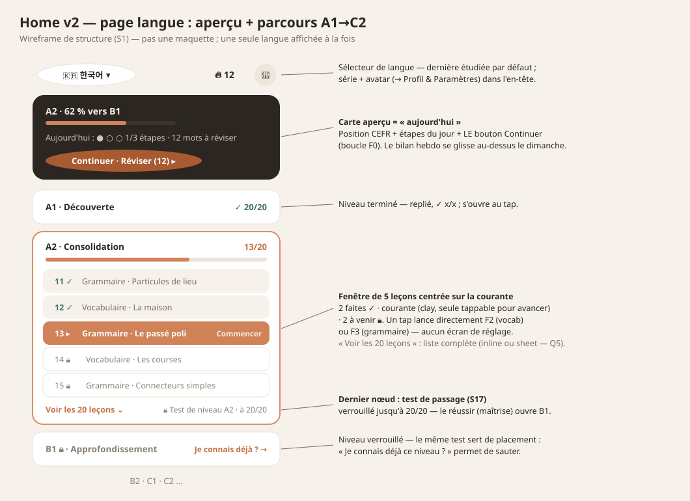
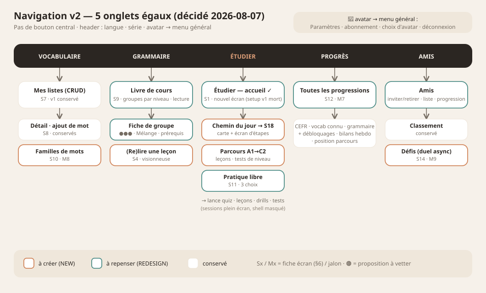
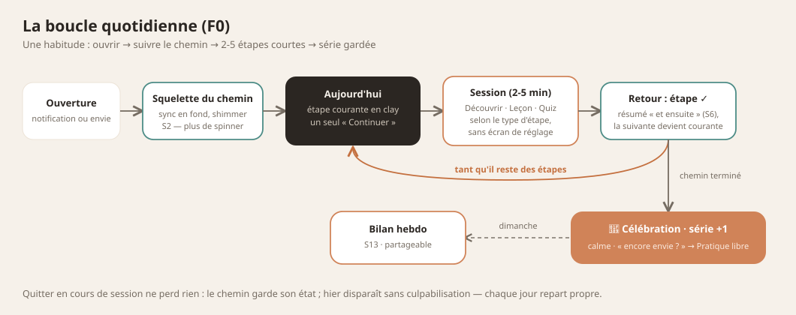
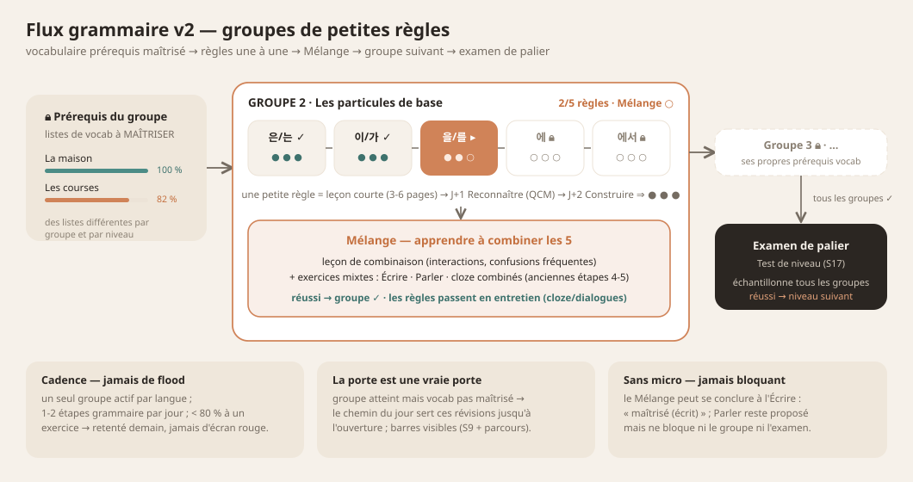

# VocabApp v2 — UX architecture & flows (design handoff)

**This is the document to give Claude Design.** It rethinks the app's
information architecture and every flow around the v2 feature set, instead
of patching new screens onto the v1 layout.

Companion references:
- `app-design-overview.md` — the CURRENT app: design system (palette,
  type, components) + live screenshots of every v1 screen. Use it for
  visual consistency; use THIS doc for structure.
- Functional specs: `../two-flow-daily-plan.md` (path, intro gate),
  `../grammar-lessons-redesign.md` (lesson viewer, stages),
  `../feature-roadmap.md` (features 1-9), `../implementation-plan-v2.md`
  (build order M1-M10).

The design system does NOT change: paper & ink, clay CTAs, teal accents,
FrostedBox cards, dark hero cards, Space Grotesk / Figtree / Space Mono /
Noto Sans KR. What changes is the app's skeleton.

---

## 1. Product model

One habit loop: **open the app → the path tells you what today is → do
2-4 short steps → done, streak kept.**

Two flows feed that path (see `diagrams/two-flow-daily-path.svg`):

- **Apprendre** (clay) — meeting NEW material, never graded on first
  contact: vocab introduction batches, grammar lessons.
- **Réviser** (teal) — practicing KNOWN material: FSRS quizzes (all
  modes), cloze, leech reinforcement, grammar production drills.

A word's life: `diagrams/word-lifecycle-gate.svg`. A rule's life:
`diagrams/grammar-stage-ramp.svg`. Both still accurate.

### Two progression tracks — vocabulary ≠ grammar

The daily path interleaves steps from BOTH tracks, but the tracks
progress on different models and must never look interchangeable:

| | **Vocabulaire** | **Grammaire** |
|---|---|---|
| Content comes from | **the user**: lists they create (+ bundled starter lists) | **the app**: curated curriculum per language module — users cannot create grammar |
| Ordering | none — FSRS decides what's due, the daily budget decides what's introduced | strict — CEFR levels → groups of ~5 small rules, each group gated by MASTERY of its prerequisite vocab lists; rules one by one, then Mélange, then next group |
| Unit of progress | per word, per direction (FR→X / X→FR) | per rule, per stage (1-5) |
| Learn moment | Découvrir batch (intro + écho) | Leçon paginée (stage 1) |
| Review moment | quiz / cloze / renforcer (leeches) | stages 2-5 drills |
| User control | full: create lists, add words, pick sources in Pratiquer | none over content; only pace (the path serves the next step) |

Design consequence: vocab steps and grammar steps need clearly distinct
step-card identities on the path (icon + label family), and Bibliothèque
must feel editable in its Listes section but read-only (a "course book")
in its Grammaire section.

### The third layer: the Parcours (A1→C2 curriculum spine)

Above both tracks sits a visible long-term map, per target language: six
CEFR levels **A1 → C2**, each a fixed, ordered set of lessons (~20 per
level). A "leçon" is the curriculum unit: either a grammar rule's
Apprendre moment or a themed, level-tagged vocab unit's Découvrir
moment. Reviews are NOT lessons — FSRS generates them daily; the
parcours only counts learn-moments.

How the layers relate:

- **Parcours** = where I'm going (levels, lessons, x/20) — the map.
- **Chemin du jour** = what I do now (2-5 steps: next parcours lessons
  interleaved with FSRS reviews) — today's slice of the map.
- The **carte aperçu** on home is the bridge: CEFR position + today's
  step progress + the single Continuer.

**Level gates:** finishing a level's lessons is not enough — a **Test de
niveau** (graded, mixed vocab + grammar) must be passed to open the next
level. Mastery, not completion. Locked levels offer the same test as a
skip-ahead/placement ("Je connais déjà ce niveau ?").

**Scope notes (honest):** user-created lists live OUTSIDE the parcours
(they flow through Bibliothèque/Pratiquer and Découvrir steps; they
never count toward x/20). The parcours is the project's biggest CONTENT
lift — levels ship progressively (Korean first), and a level may be
partially filled ("13 leçons disponibles — la suite arrive") without
breaking the design. This layer is NEW relative to
`implementation-plan-v2.md` (it extends M3's path generator, M5's
curriculum content, and M7's CEFR estimation) — the plan needs a
revision pass once designs land.

## 2. Design principles

1. **One dominant action per screen.** The path's current step is THE
   button on home; everything else steps back visually.
2. **Calm, anti-pressure.** No red badges screaming counts. Progress is
   celebrated, lateness is never scolded (keep v1's tone).
3. **Learn ≠ test.** Apprendre surfaces (intro, lessons) must FEEL
   different from Réviser surfaces (quiz): no timers, no grading UI, no
   progress-toward-pass. Suggested cue: clay-tinted vs teal-tinted
   headers/accents per flow, consistently.
4. **Multi-language is structural.** Every learning surface is tagged
   with the language pair (flags), every list view is filterable by
   pair, every language name is shown in its own autonym, scripts render
   through the Script resolver. Nothing may assume Korean.
5. **Short sessions, visible exits.** Every session type is 2-5 min,
   interruptible, and returns to the path with state preserved. In-app
   back arrow on every pushed screen (system back must be fixed to match).

## 3. New navigation

**5-slot bottom nav, re-purposed:**

| Slot | v1 | v2 | Why |
|---|---|---|---|
| 1 | Accueil (cards) | **Parcours** — the current language's page: carte aperçu (today) + niveaux A1→C2 | The map IS the product; home = one language, last studied, switcher in the header. |
| 2 | Listes | **Bibliothèque** — Listes · Grammaire · Familles | All content browsing in one place; grammar stops being a home card, word families get a home. |
| center FAB | New-session accordion | **Pratiquer** — free practice, 3-step quick setup | Kept for self-directed drilling, but simplified; the path absorbs guided session-starting. |
| 3 | Amis | **Amis** — classement · défis | Unchanged position; challenges (M9) revive this tab. |
| 4 | Profil | **Progrès** — dashboard + CEFR | Progress is a retention feature; it earns the tab. Profile & settings move to an avatar button (top-right of Parcours and Progrès) opening the Profil screen. |

What moved where:

- Grammar hub: home card → **Bibliothèque › Grammaire**.
- Stats: Profil › Statistiques → **Progrès tab** (full dashboard).
- Profile, subscription, settings: Profil tab → **avatar button** →
  Profil screen (kept mostly as-is) → Paramètres (kept).
- Review-mode sheet (Voix/Mains libres/Écrit/Cartes): kept, now opened
  from a path step's mode affordance and from Pratiquer.
- Notifications settings: stays under Paramètres; the bell disappears
  from home (the path + streak communicate "what's due" now).

## 4. Screen inventory

Status: **NEW** = design from scratch · **REDESIGN** = exists, restructure
· *keep* = reskin at most.

| # | Screen | Status | Milestone | Brief |
|---|---|---|---|---|
| S1 | Page langue : aperçu + parcours A1→C2 (home) | **REDESIGN** (replaces Home) | M3+ | §6.1 |
| S2 | Préchargement (gate avant l'accueil) | **REDESIGN** | M3 | §6.2 |
| S3 | Intro vocab « Découvrir » + écho | **NEW** | M4 | §6.3 |
| S4 | Visionneuse de leçon (grammaire) | **NEW** | M5 | §6.4 |
| S5 | Quiz canvas (toutes modalités) | *keep* + additions | M6 | §6.5 |
| S6 | Résumé de session | **REDESIGN** (light) | M3 | §6.6 |
| S7 | Bibliothèque (hub 3 sections) | **NEW** (absorbs Listes) | M5/M8 | §6.7 |
| S8 | Détail de liste / ajout de mot | *keep* | — | §6.7 |
| S9 | Fiche règle de grammaire | **REDESIGN** (5 pastilles) | M5 | §6.8 |
| S10 | Famille de mots (browser) | **NEW** | M8 | §6.9 |
| S11 | Pratiquer (quick setup) | **REDESIGN** (accordion → 3 steps) | M3 | §6.10 |
| S12 | Progrès (dashboard + CEFR) | **REDESIGN** (replaces Stats) | M7 | §6.11 |
| S13 | Bilan hebdo | **NEW** | M2 | §6.12 |
| S14 | Amis + Défis | **REDESIGN** (adds challenges) | M9 | §6.13 |
| S15 | Profil (via avatar) / Paramètres / Paywall | *keep* | — | — |
| S16 | Onboarding (première ouverture) | **NEW** (light) | M3 | §6.14 |
| S17 | Test de niveau (+ résultats) | **NEW** | TBD (post-M5) | §6.15 |

## 5. Flows

### F0 — Daily loop (the spine)

Open app → preload gate (S2) until everything is ready → **Aujourd'hui**
with the current step highlighted → tap it → the right session type opens directly (no
setup) → finish → return to the path: step animates to ✓, next step
becomes current → repeat → all steps done → completion celebration
(streak +1) → if a weekly recap is available, its card sits on top of the
completed path. Leaving mid-session never loses the path's state. (Warm
resumes skip the gate; it returns only when data must be rebuilt.)

### F1 — First run

Welcome/auth (keep) → choose UI language (autonyms, keep) → **choose
first learning pair** (target language picker, flags + autonyms) →
choose daily pace (new-word budget: relaxed ~4 / normal ~8 / intense
~12, changeable later in Paramètres) → starting point: "Je débute →
commencer en A1" or "J'ai déjà des bases → test de placement" (reuses
S17; passing places the user at the right level) → land on the home
where the parcours shows A1 (or the placed level) and the day's chain is
seeded with its first lessons.

### F2 — Découvrir (vocab introduction, M4)

Path step "Découvrir · N nouveaux mots · 🇫🇷→🇰🇷" → full-screen intro
deck: one word per page (word, romanization if relevant, translation,
example sentence, auto-play audio + tap-replay), swipe through the batch
of 5-10 → **écho practice**: ungraded multiple-choice both directions
over the just-seen batch, instant feedback, no score kept → "C'est vu !"
close screen → back to path, step ✓. Words become review-eligible
(`introducedAt` set) — see the lifecycle diagram.

### F3 — Grammar flow (M5): groups of small rules

**Structure: level → groupes → petites règles.** A CEFR level contains
a few **groupes** of ~5 **small** rules (one focused idea per rule: one
particle, one tense form, one connector — a rule that needs more splits).
The user learns the group's rules **one by one**, then the group's
**Mélange** phase teaches combining them, then the next group unlocks.
The level ends on its Test de niveau (S17) — the tier mastery exam.

**Vocab prerequisites — kept from v1, now per group.** Each group
declares prerequisite vocab lists (different lists per group and per
level) that must be **MASTERED, not just introduced**, before the group
opens. A reachable-but-locked group shows per-list mastery bars
("La maison · 82 %") — the v1 mechanic, promoted to group scope — and
the daily chain fills with those reviews until the gate opens. Lesson
examples and drill sentences only ever use prerequisite + earlier vocab.

**One rule ≈ 2-3 days:** leçon courte (3-6 pages, viewer S4; resumes
where quit) → J+1 **Reconnaître** (MCQ, ~8 items) → J+2 **Construire**
(chip assembly, ~6). Small rules, small ramps — per-rule progress is
three dots ●●●. Production is no longer trained rule-by-rule.

**The Mélange phase (group-level):** after the 5 rules — a short
combining lesson (how the rules interact, common confusions) + mixed
drills carrying the old stages 4-5: **Écrire** and **Parler** sessions
whose sentences combine several of the group's rules, plus combined
cloze. Passing the Mélange completes the group and unlocks the next.
*Evolution of the 5-stage ramp: stages 1-3 live per rule; stages 4-5
are carried by the group's Mélange.*

**After the group — entretien.** Completed groups stop generating
steps; their rules live on inside reviews via cloze and dialogues.

**Flow control:**
- **One group in flight** per language; max **1-2 grammar steps/day**
  in the chain.
- Drills pass at ≥~80 %; below → calm "on y revient demain" with an
  easier mix. Never a red fail screen.
- **No-mic:** the Mélange can complete at Écrire as "maîtrisé (écrit)";
  Parler stays offered, never blocking.

**Parcours mapping:** node types become **Vocabulaire · Grammaire
(règle) · Mélange** — a group of 5 rules = 6 nodes. Prerequisite vocab
units are placed before their group in the level's order, but the
mastery gate still applies if the user rushed ahead. The level test
unlocks once all the level's groups (Mélanges included) are done, and
samples across them.

Entry points: parcours nodes · daily-chain drills · fiche de groupe S9
("Relire", "S'entraîner maintenant") · Bibliothèque › Grammaire.

### F4 — Réviser / Renforcer (existing quiz, extended)

Path step "Réviser · N mots · pair" → mode comes from the user's last
choice for that step type; a small mode chip on the step opens the
Voix/Mains libres/Écrit/Cartes sheet (pattern kept from v1 screenshot
02). Session may now include **cloze cards** (M6): sentence with a blank
where the due word goes — same canvas, new card layout. "Renforcer"
steps are the same flow scoped to leech words (M1).

### F5 — Pratique libre

Center FAB → 3 quick choices, all remembering last use: **Langue**
(pairs with content) → **Source** (À réviser · Mots difficiles · a
list, split "en cours d'étude" / "pas encore étudiées" with preview-eye,
kept from v1) → **Mode** → Commencer. Card count moves to Paramètres as
a default (removes one accordion step). Unstudied lists picked here get
a gentle notice: "Ces mots passeront d'abord par Découvrir" — free
practice must not bypass the intro gate.

### F6 — Progrès

Progrès tab → per-pair filter chips (flags) at top → CEFR card per
target language ("🇰🇷 A2 · 62 % vers B1" + breakdown sheet: vocab size,
grammar mastered, what moves the needle) → charts at day/week/month/all
scales (reviews, accuracy, words known) → recent sessions list (kept) →
entry to past Bilans hebdo.

### F7 — Familles de mots (M8)

Entry points: chip on quiz answer reveal ("Famille : 學 étude") and on
list-detail rows → Family page: root card (hanja or Latin/Germanic root,
label, meaning), member words with per-word progress dots, tap-audio →
tap a member → its family page. Bibliothèque › Familles lists all
families discovered so far (locked/greyed until first member met).

### F8 — Défis (M9)

Amis › Défis → "Défier" on a friend → pick list (shared/public) + mode +
count → both play the same card set async → results screen:
side-by-side scores, per-word comparison → rematch CTA. Notification on
completion. (Scope confirmed after the M9 audit.)

### F10 — Parcours & tests de niveau

Home shows the CURRENT language's page (last studied; header chip
switches among studied pairs). Scroll the parcours: level cards A1→C2 —
**done** (✓ x/x, collapsed), **current** (expanded by default),
**locked** (🔒). Expanding a card never navigates; it reveals a
**windowed lesson list**: 5 rows centered on the current lesson (2 done
✓ above, current highlighted with Commencer, 2 upcoming below), plus
"Voir les 20 leçons" for the full scrollable list. Tapping the current
lesson starts it directly (F2 for vocab units, F3 for grammar). The
level's final row is its **Test de niveau** node (locked until x/x) →
S17 → pass unlocks the next level (celebration); fail gives a calm
per-area breakdown and schedules Renforcer/lesson-revisit steps in the
daily chain — retake anytime. On a LOCKED level, the same test is
offered as skip-ahead: "Je connais déjà ce niveau ? Passer le test"
(placement; data semantics of "levels marked acquired" to be settled in
the functional spec).

### F9 — Bilan hebdo (M2)

Sunday/first open after week end: card atop the path → full-screen
celebratory recap: words learned, reviews done, retention %, streak
held, best day — shareable-feeling layout (screenshot-friendly) →
"Continuer" back to path. Also reachable later from Progrès.

## 6. Per-screen briefs

Every screen must spec: empty, loading, error, and (where relevant)
celebration states; light AND dark theme; all text length-robust
(French/German run long) and script-robust (Hangul via Noto Sans KR).

### 6.1 S1 Page langue — aperçu + parcours (home)
Replaces Home entirely; shows ONE language at a time (see the wireframe
`diagrams/v2-home-parcours.svg`). Top to bottom:

1. **Header**: language chip (flag + autonym, tap → switcher sheet over
   studied pairs + "Ajouter une langue"), streak flame + count, avatar
   button. The dark streak hero card dies; streak lives here.
2. **Carte aperçu** (the dark hero survives as this): CEFR position
   ("A2 · 62 % vers B1", mini progress bar), today's slice ("Aujourd'hui
   : 1/3 étapes" as dots + due count), and THE dominant CTA
   **Continuer** → next step of the day's chain (F0 order: reviews +
   next parcours lessons). Mode chip for review steps lives here. When
   the day is done: celebration state + "encore envie ?" → Pratiquer.
   The Bilan hebdo card slots above it when available.
3. **Le parcours**: six level cards A1→C2 per §F10 — collapsed done
   (badge, name, ✓ 20/20), current expanded (x/20 + bar, windowed
   5-lesson list — rows: number, type icon vocab/grammaire/mélange,
   title, state ✓/current/🔒 — and "Voir les 20 leçons"), locked (🔒 +
   "Je connais déjà ? Passer le test"), each level ending on its Test
   de niveau node. Partial levels show "13 leçons disponibles — la
   suite arrive".

Daily steps are not a separate list anymore: "today" is compressed into
the aperçu card, the map below gives it meaning. States: behind S2 gate
on cold open; offline → cached page + banner; new pair with no
curriculum yet → parcours placeholder ("le programme <langue> arrive") +
CTA to Bibliothèque/Pratiquer (lists still work for any pair).

### 6.2 S2 Préchargement — the gate before home
A dedicated full-screen gate shown BEFORE Aujourd'hui on cold open, and
dismissed **only when loading is fully done** (sync, path generation,
lists) — the home must always arrive complete, never half-populated or
reordering under the user's eyes (established v1 direction). Content:
brand/waveform motif + one status line that progresses
("Synchronisation…" → "Préparation de ton chemin…"); calm, no raw
spinner. >8s → retry affordance; offline → dismiss with cached data and
show an offline banner on home.

### 6.3 S3 Découvrir — intro deck + écho
Two sub-surfaces, Apprendre-themed (clay): (a) intro deck — one word per
page, big type (target script prominent, source below), audio replay,
example sentence with the new word highlighted `[[clay]]`, page dots,
free swipe both ways; (b) écho — MC quick-check widget (same component
as lesson quick checks), both directions, instant feedback, explicitly
unscored ("aucune note — on découvre"). Exit anytime; batch resumes
where left. End screen: word chips of the batch + "Ils arriveront dans
tes révisions".

### 6.4 S4 Visionneuse de leçon
Paged, one idea per page, 6-10 pages, ≤2-3 sentences each. Page types:
explain (highlight markup `[[clay]]` / `((teal))`), example (sentence +
tap-per-line audio + translation), quick-check (MC, unscored, note on
answer), dialogue (2 speakers, distinct voice roles, play-all +
tap-per-line, speaker-colored bubbles). Free two-way navigation, page
dots + back arrow, per-page narration control (play/pause, voice roles;
device-TTS on free tier). Last page: "Terminé" CTA. Reopenable anytime
from S9 in review mode (no state change).

### 6.5 S5 Quiz canvas
Keep v1's canvas (progress bar, counter, big word, waveform for voice).
Additions: cloze card layout (sentence with blank chip, typed or chip
answer); answer reveal gains the Famille chip (S10 entry); Réviser
theming (teal accents) to contrast with Apprendre surfaces.

### 6.6 S6 Résumé de session
Light redesign: score, per-word list (kept) + **"et ensuite"** block —
next path step CTA when the session came from the path ("Continuer le
chemin") or "Retour" when from Pratiquer. This is the glue that makes
the path feel continuous.

### 6.7 S7 Bibliothèque
New hub with three segmented sections, pair-filter chips persistent at
top: **Listes** (v1 Mes listes content: cards, colored dots, FAB
Nouvelle liste; detail + add-word dialog kept as-is — this is the USER's
editable space), **Grammaire** (v1 hub content restructured — see S9;
read-only curriculum, no create/add affordances anywhere: it must read
as a course book, not a notebook), **Familles** (S10 index; hidden or
teaser state until M8). Empty states per section per pair.

### 6.8 S9 Bibliothèque › Grammaire (groupes + fiches)
The "course book", organized level → **group cards**: group name ("Les
particules de base"), x/5 règles done + Mélange state, ✓ when complete
— and when a group is reachable but locked, its **prerequisite mastery
bars, one per vocab list** ("La maison ▰▰▰▱ 82 %"): the v1 unlock
mechanic, kept at group scope. Groups in locked levels: greyed 🔒.
Tap a group → group detail: rule rows (name, one-line summary, ●●● dots
leçon/reconnaître/construire), the Mélange row (its own state), the
prerequisite lists with bars + link to review them, "Relire la leçon"
on any done rule, "S'entraîner maintenant" on the current drill (runs
it immediately — same session the chain would serve), and the hint "la
prochaine étape arrive dans ton chemin".

### 6.9 S10 Famille de mots
What it is (roadmap #7): words sharing a root shown as a family, so
memorization becomes a network — Korean 학교/학생/학년 all contain
학 (hanja 學, "étude"); French/European targets use Latin/Germanic
roots the same way (*spect* "voir" → spectacle, inspecter, spectateur).
The screen: root hero (glyph/root large, label, meaning), member word
rows (word, translation, progress dot, audio), cross-links between
families. Generic design: the hero must work for both a hanja glyph
("學 · étude") and a text root ("spect · voir").

### 6.10 S11 Pratiquer
Bottom-sheet or full screen (designer's call) with the 3 memory-holding
choices of F5 and one big Commencer. Must feel instant: two taps for a
repeat of last session. Keeps v1's studying/not-studied split + preview
eye in the list picker.

### 6.11 S12 Progrès
Dashboard: pair chips → CEFR level card (per target language, honest
"estimation" wording, progress to next level, tappable breakdown) →
scale switcher (Jour/Semaine/Mois/Tout) → charts (reviews, accuracy,
words known — fl_chart) → recent sessions → past recaps. Empty state
(new user): "ton premier bilan arrive dimanche" + seeded zero charts.

### 6.12 S13 Bilan hebdo
Full-screen, celebratory, screenshot-shareable: big numbers (mots
appris, révisions, rétention %, série), one highlight ("meilleur jour :
mardi"), warm illustration/waveform motif. One CTA: Continuer. Design
both "great week" and "quiet week" (2 reviews) variants — never shaming.

### 6.13 S14 Amis + Défis
Two segments: Classement (kept) · Défis (new): active challenges
(vs-cards with avatars + state), history, "Défier" flow (F8), results
screen with side-by-side bars. Empty: "défie un ami" teaser.

### 6.14 S16 Onboarding
Reuse existing welcome/auth visuals; add three light steps (pair picker,
pace picker, starting point "Je débute / J'ai des bases → placement") as
full-screen cards in the same style. Must support adding MORE pairs
later (home language chip + Bibliothèque "+ Ajouter une langue" — same
pair-picker component).

### 6.15 S17 Test de niveau
The level gate (F10) and placement test. A graded mixed session over the
level's curriculum: vocab both directions + grammar
recognition/construction, ~20-30 items, progress bar, **no per-item
feedback** (unlike quizzes — answers reveal only at the end). Pass
threshold ~85 %. Results screen: **pass** → unlock celebration, next
level opens; **fail** → calm per-area breakdown ("les particules te
résistent encore"), CTA "Réviser ça" (schedules Renforcer + lesson
revisits in the daily chain), retake anytime, never shaming. Visual
identity: neutral ink — neither clay (learn) nor teal (review); it's an
assessment and must feel sober but not scary. Entry variants: end-of-
level node, locked-level skip-ahead, onboarding placement.

## 7. Cross-cutting rules

- **Flow theming:** Apprendre surfaces = clay accent family; Réviser
  surfaces = teal accent family; neutral surfaces (Bibliothèque,
  Progrès) = ink/paper. Applied to headers, progress elements, CTAs.
- **Pair tagging:** any card/step/chart representing pair-scoped data
  shows the pair (flag pair or "🇫🇷→🇰🇷" compact form). Language names
  always in autonyms in pickers.
- **Back:** in-app back arrow on every pushed screen; system back must
  pop, not exit (bug fix planned alongside M3).
- **Notifications:** one daily reminder aligned to path completion
  ("ton chemin t'attend — 2 étapes"), recap notification Sunday.
  Configured in Paramètres (v1 screen kept).
- **Dark theme:** every new screen specs dark from day one (inkDark
  base, onDark text — see design-system tables).
- **Premium:** free tier gets everything structural; ElevenLabs voices
  (lesson narration roles, dialogue voices) and unlimited AI (families
  generation beyond cache, dialogue generation) are the premium levers —
  paywall entry points on those affordances, never blocking the path.

## 8. Open questions for Claude Design

1. Parcours visual language: expandable level cards (assumed here, fits
   paper/ink) vs a Duolingo-like winding trail of lesson nodes.
   Recommendation: cards.
2. Celebration style (day done, level unlocked, recap): illustration,
   confetti, or waveform-motif animation? Must stay "calm" (principle 2).
3. Where the review-mode chip lives on the aperçu card without
   cluttering the one-dominant-action rule.
4. Bibliothèque: segmented control vs top-tabs for the three sections.
5. "Voir les 20 leçons": expand inline vs bottom sheet.
6. Locked-level treatment: how inviting should the skip-ahead test be
   (prominent chip vs discreet text link)?
7. Groups on the parcours: 6 flat nodes with a subtle group label
   (recommended) vs a nested group sub-card inside the level card.
